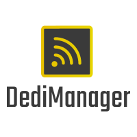

# DediManager

[![Contributors][contributors-shield]][contributors-url]
[![Forks][forks-shield]][forks-url]
[![Stargazers][stars-shield]][stars-url]
[![Issues][issues-shield]][issues-url]
[![MIT License][license-shield]][license-url]
[![LinkedIn][linkedin-shield]][linkedin-url]
[![Twitter][twitter-shield]][twitter-url]
[![Website][website-shield]][website-url]


<!-- PROJECT LOGO -->
<br />
<p align="center">
  <a href="https://github.com/KyleYYC/DediManager">
    
  </a>
  <p align="center">
    DediManager is a Linux Java based application developed to manage, secure, and automate your Minecraft Server Network!
    <br />
    <a href="https://github.com/KyleYYC/DediManager/"><strong>Explore the docs »</strong></a>
    <br />
    <br />
    <a href="#demo">View Demo</a>
    ·
    <a href="https://github.com/KyleYYC/DediManager/issues">Report Bug</a>
    ·
    <a href="https://github.com/KyleYYC/DediManager/issues">Request Feature</a>
  </p>
</p>


<!-- TABLE OF CONTENTS -->
<details open="open">
  <summary>Table of Contents</summary>
  <ol>
    <li>
      <a href="#about-the-project">About The Project</a>
      <ul>
        <li><a href="#introduction">Introduction</a></li>
        <li><a href="#objective">Objective</a></li>
        <li><a href="#features">Features</a></li>
        <li><a href="#built-with">Built With</a></li>
      </ul>
    </li>
    <li>
      <a href="#getting-started">Getting Started</a>
      <ul>
        <li><a href="#prerequisites">Prerequisites</a></li>
        <li><a href="#installation">Installation</a></li>
        <ul>
          <li><a href="#centos-7">Centos 7</a></li>
          <li><a href="#centos-8">Centos 8</a></li>
          <li><a href="#debian-9">Debian 9</a></li>
          <li><a href="#debian-10">Debian 10</a></li>
          <li><a href="#ubuntu">Ubuntu</a></li>
        </ul>
        <li><a href="#minecraft-proxy">Minecraft Proxy</a></li>
        <ul>
          <li><a href="#bungeecord">Bungeecord</a></li>
          <li><a href="#waterfall">Waterfall</a></li>
        </ul>
      </ul>
    </li>
   <li>
      <a href="#usage">Usage</a>
      <ul>
        <li><a href="#demo">Demo</a></li>
        <li><a href="#commands">Commands</a></li>
      </ul>
    </li>
    <li><a href="#roadmap">Roadmap</a></li>
    <li><a href="#contributing">Contributing</a></li>
    <li><a href="#license">License</a></li>
    <li><a href="#contact">Contact</a></li>
    <li><a href="#acknowledgements">Acknowledgements</a></li>
  </ol>
</details>


<!-- ABOUT THE PROJECT -->
## About The Project

<p align="center">
  <a href="https://github.com/KyleYYC/DediManager">
    
  </a>
</p>

DediManager is a Linux based application written in java and developed to manage, secure, and automate your Minecraft Server Network. A big part of every server owners goal is to grow and gain and more loyal and engaged playerbase. When upgrading and expanding your servers playerbase you have plenty of expenses already coming your way, the idea of potentially adding more expenses before increasing revenue can be intimidating. A large majority of server owners are running on shared hosts with Multicraft or Pterodactyl setup. The convenience of these services are very appealing and usually the best option for starting off. However once your server is bringing in revenue, you need to start treating it like a business by planning on expanding to take your server to the next level.

<!--Introduction-->

<p align="center">
  <a href="https://github.com/KyleYYC/DediManager">
    
  </a>
</p>

Performance & connectivity is one of the most crucial parts to your server success, if either are suffering you are potentially sending players to find a server without those issues present. Having your TPS at 20.00 and fast connection speeds will guarantee more player satisfaction and can also be turned into a strong marketing tactic as many servers struggle with this issue. This is where server owners look to upgrade to a virtual private server or a dedicated server to give them more bang for their buck, mainly will pay a system admin a 1 time fee often ranging of above $30 USD to ultimately just type a few commands. This is where the idea for DediManager started, the idea of creating a program that was programmed to create and manager custom minecraft network's running on any operating system for a small 1 time fee.

DediManager comes with many useful and important tools to ensure your server is running at it's highest performance some examples of features are:
 * Extensive User Interface
 * File Editing & Management
 * Multiple Users
 * Scheduled Backups
 * Security & Network Protection
 * and many more!

<p align="center">
  <a href="https://github.com/KyleYYC/DediManager">
    
  </a>
</p>

DediManager's objective is to simplify the transition and startup of Minecraft server networks running on any operating system. It was developed to be a "plug n play" application that requires 0 knowledge on dedicated servers. It is also a great tool to transfer already existing networks and servers to different systems, making anybody with FTP access able to transfer server data. Editing files such as 'server.properties' or 'spigot.yml' becomes very tedious and can get messy quickly when you have many servers running on a system. The File Editing & Management system makes this process simple, print out differences, change values, and reset any minecraft server file. 

<p align="center">
  <a href="https://github.com/KyleYYC/DediManager">
    
  </a>
</p>

This is a list of features

<!-- GETTING STARTED -->
## Getting Started

This is an example of how you may give instructions on setting up your project locally.
To get a local copy up and running follow these simple example steps.

### Prerequisites

This is an example of how to list things you need to use the software and how to install them.
* npm
  ```sh
  npm install npm@latest -g
  ```

## Installation

1. Get a free API Key at [https://example.com](https://example.com)
2. Clone the repo
   ```sh
   git clone https://github.com/your_username_/Project-Name.git
   ```
3. Install NPM packages
   ```sh
   npm install
   ```
4. Enter your API in `config.js`
   ```JS
   const API_KEY = 'ENTER YOUR API';
   ```
### Centos 7

This is for centos 7

### Centos 8

This is for centos 8

### Debian 9

This is for Debian 9

### Debian 10

This is for Debian 10

### Ubuntu

This is for Ubuntu

## Minecraft Proxy

### Bungeecord

This is for Bungeecord

### Waterfall

This is for Waterfall

<!-- USAGE EXAMPLES -->
## Usage

Use this space to show useful examples of how a project can be used. Additional screenshots, code examples and demos work well in this space. You may also link to more resources.

_For more examples, please refer to the [Documentation](https://example.com)_

## Demo

Demo of Application

## Commands

Commands List

<!-- ROADMAP -->
## Roadmap

See the [open issues](https://github.com/othneildrew/Best-README-Template/issues) for a list of proposed features (and known issues).


<!-- CONTRIBUTING -->
## Contributing

Contributions are what make the open source community such an amazing place to be learn, inspire, and create. Any contributions you make are **greatly appreciated**.

1. Fork the Project
2. Create your Feature Branch (`git checkout -b feature/AmazingFeature`)
3. Commit your Changes (`git commit -m 'Add some AmazingFeature'`)
4. Push to the Branch (`git push origin feature/AmazingFeature`)
5. Open a Pull Request


<!-- LICENSE -->
## License

Distributed under the MIT License. See `LICENSE` for more information.


<!-- CONTACT -->
## Contact

Your Name - [@your_twitter](https://twitter.com/your_username) - email@example.com

Project Link: [https://github.com/your_username/repo_name](https://github.com/your_username/repo_name)


<!-- ACKNOWLEDGEMENTS -->
## Acknowledgements
* [GitHub Emoji Cheat Sheet](https://www.webpagefx.com/tools/emoji-cheat-sheet)
* [Img Shields](https://shields.io)
* [Choose an Open Source License](https://choosealicense.com)
* [GitHub Pages](https://pages.github.com)
* [Animate.css](https://daneden.github.io/animate.css)
* [Loaders.css](https://connoratherton.com/loaders)
* [Slick Carousel](https://kenwheeler.github.io/slick)
* [Smooth Scroll](https://github.com/cferdinandi/smooth-scroll)
* [Sticky Kit](http://leafo.net/sticky-kit)
* [JVectorMap](http://jvectormap.com)
* [Font Awesome](https://fontawesome.com)


<!-- MARKDOWN LINKS & IMAGES -->
<!-- https://www.markdownguide.org/basic-syntax/#reference-style-links -->
[contributors-shield]: https://img.shields.io/badge/Contributors-1-green?style=for-the-badge
[contributors-url]: https://github.com/othneildrew/Best-README-Template/graphs/contributors
[forks-shield]: https://img.shields.io/badge/Forks-0-blue?style=for-the-badge
[forks-url]: https://github.com/othneildrew/Best-README-Template/network/members
[stars-shield]: https://img.shields.io/badge/Stars-0-blue?style=for-the-badge
[stars-url]: https://github.com/othneildrew/Best-README-Template/stargazers
[issues-shield]: https://img.shields.io/badge/Bugs-0-brightgreen?style=for-the-badge
[issues-url]: https://github.com/othneildrew/Best-README-Template/issues
[license-shield]: https://img.shields.io/badge/License-GNU-orange?style=for-the-badge
[license-url]: https://github.com/othneildrew/Best-README-Template/blob/master/LICENSE.txt
[linkedin-shield]: https://img.shields.io/badge/-LinkedIn-black.svg?style=for-the-badge&logo=linkedin&colorB=555
[linkedin-url]: https://github.com/KyleYYC/DediManager/
[twitter-shield]: https://img.shields.io/badge/-Twitter-black.svg?style=for-the-badge&logo=twitter&colorB=555
[twitter-url]: https://twitter.com/realKyleYYC
[website-shield]: https://img.shields.io/badge/Website-black.svg?style=for-the-badge&logo=web&colorB=555
[website-url]: https://github.com/KyleYYC/DediManager/
[product-screenshot]: images/screenshot.png
